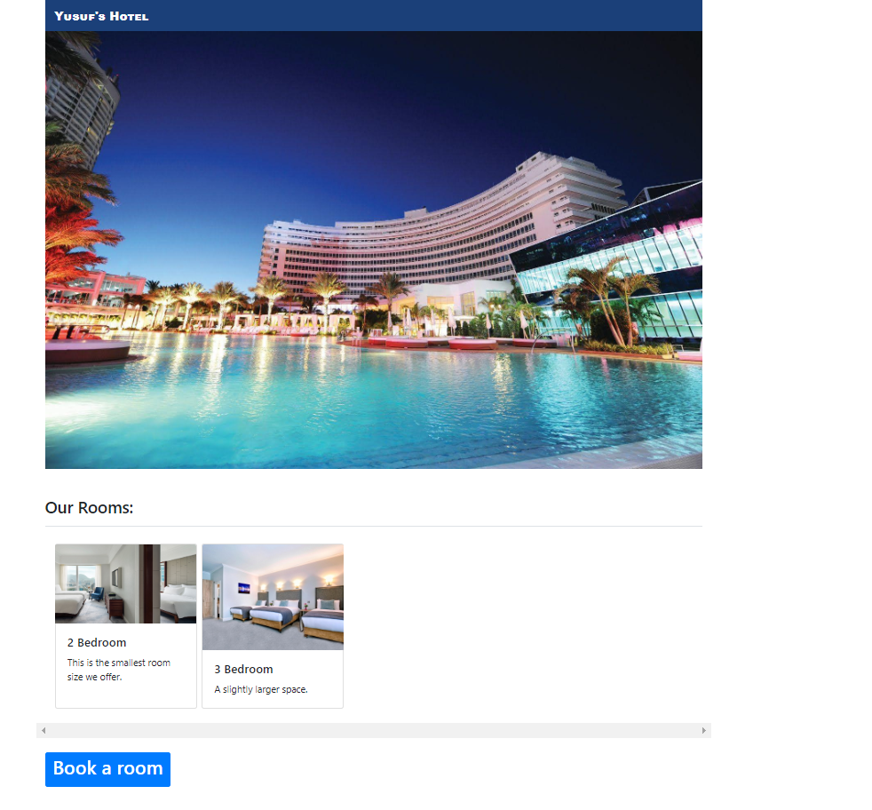
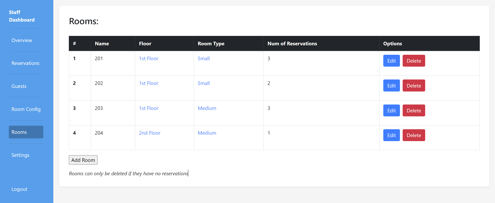
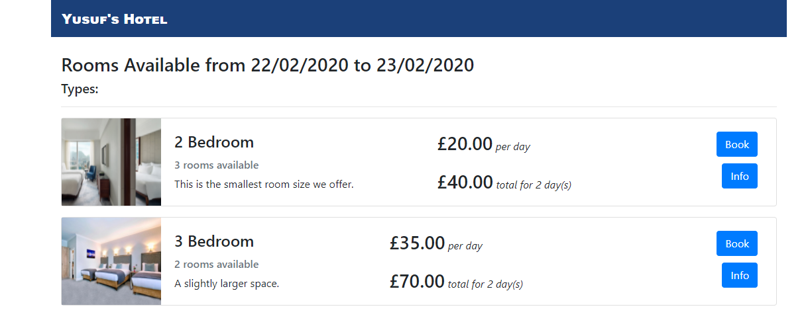
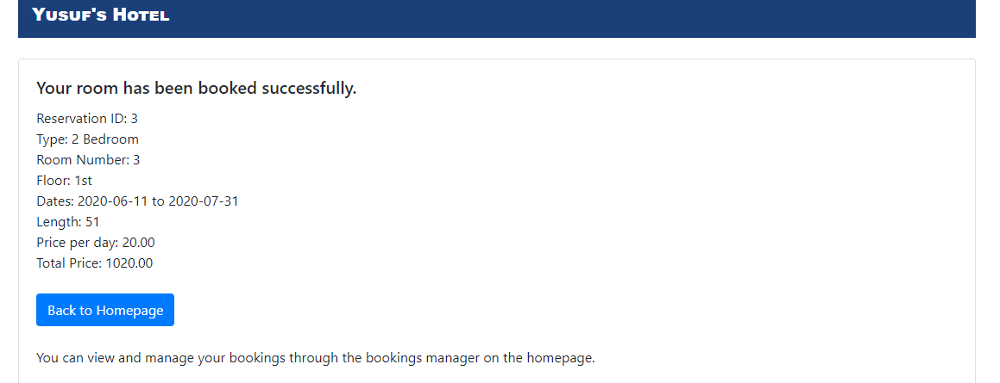
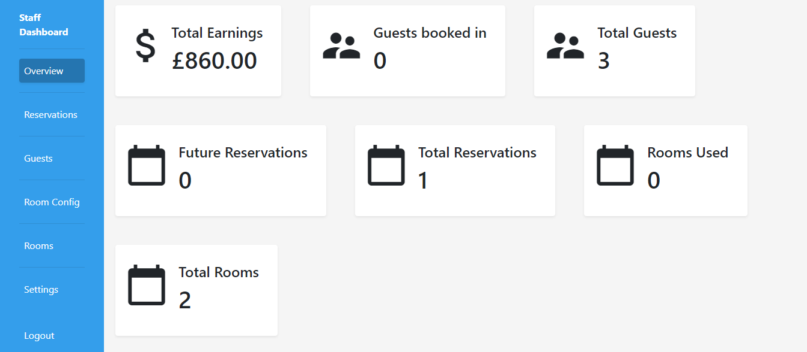

# Hotel Booking System

## Images

<p align="center">
  
  
  
  
  
  
</p>

## Description

This is a Flask-based hotel booking system that provides a user-friendly platform for managing hotel bookings. It allows guests to browse available rooms, make reservations, and manage their bookings, while providing hotel staff with a comprehensive dashboard for overseeing all aspects of hotel operations. 

## Features

**Guest Interface:**
- Browse available rooms by date range
- View room details, including images, descriptions, and amenities
- Securely register an account with password hashing
- Log in to manage existing bookings
- Make new reservations
- Cancel bookings
- Extend stays (subject to room availability)
- View booking confirmations

**Staff Interface:**
- Secure staff login
- Dashboard overview with key hotel statistics
- Manage reservations 
- Manage guest information 
- Configure room types 
- Manage floors 
- Manage individual rooms 
- Adjust system settings, including hotel name, theme color, cover image, and admin credentials


## Installation

1. **Clone the repository:**
   ```bash
   git clone https://github.com/your-username/hotel-booking-system.git
   cd hotel-booking-system 
   ```
2. **Create and activate a virtual environment (recommended):**
   ```bash
   python3 -m venv env
   source env/bin/activate
   ```
3. **Install the dependencies:**
   ```bash
   pip install -r requirements.txt
   ```

## Setup

Here are the instructions on setting up your hotel and guest login for the Reservation Manager, incorporating these points into the README.md:

## Setup

1. **Database Initialization:** 
   - Run the application (`flask run`) to automatically create the SQLite database.

2. **Initial Settings:**
   - The application is pre-populated with default settings.
   - Access the staff dashboard (uat `/staff_login` after running the app) and log in with the default credentials (**username = "admin", password = "admin"**) to customize these settings.

3. **Configuring Your Hotel:**

   - **Log in to the Staff Dashboard:**  Navigate to `/staff_login`
     
   - **Create Room Types:** Go to the "Room Configuration" section of the dashboard.  Add descriptions, set rates, and upload images for each room type (e.g., "Single Room", "Double Room", "Suite").

   - **Manage Floors:**  Define the floors in your hotel (e.g., "1st Floor", "2nd Floor").

   - **Add Individual Rooms:**  In the "Rooms" section, assign each room a number, select its floor, and link it to a room type.

4. **Guest Access to Reservation Manager:**

   - **Guests can access the Reservation Manager from the homepage.** They will need to create an account first by going through the booking process. Once an account is created, they can use their email and password to log in and manage their bookings.

## Running the Application

1. **Start the Flask development server:**
   ```bash
   flask run
   ```
2. **Access the application:** Open a web browser and navigate to `http://127.0.0.1:5000/` (or the URL specified in the terminal).

## Technologies Used

- **Flask:** Web framework for building web applications
- **SQLAlchemy:**  Object-relational mapper (ORM) for interacting with the database
- **SQLite:**  Database for storing application data
- **HTML:** For structuring web pages
- **CSS:** For styling web pages
- **Bootstrap:** CSS framework for responsive design and mobile-friendliness
- **Python:** Server-side programming language

## Project Structure

```
hotel-booking-system/
  - app.py             # Main Flask application file
  - templates/          # HTML template files
    - layout.html        # Base template
    - index.html        # Homepage template
    - ...               # Other template files
  - requirements.txt   # List of project dependencies
```
